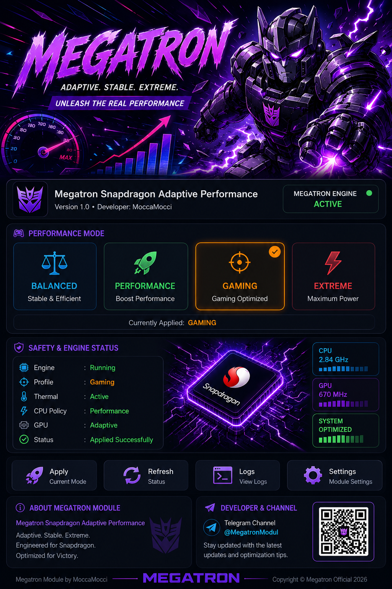

# ⚡ Megatron Snapdragon Adaptive Performance

  

**Version 1.2.0 — MoccaMocci**

Adaptive performance module for Qualcomm Snapdragon Android devices.

### Profiles
Balanced • Performance • Gaming • Extreme

The engine checks device/kernel capabilities before applying supported settings.

### WebUI
- Device detection
- Refresh detection
- Profile selection
- Persistent profile
- Clear apply/error status
- Local KernelSU WebUI bridge (no external CDN required)

### Safety
- Thermal protection remains enabled.
- No voltage changes.
- No blind CPU/GPU frequency forcing.
- Unsupported interfaces are skipped.

Official Telegram: https://t.me/MegatronModul

**Megatron Modul by MoccaMocci**  
**Copyright © Megatron Official 2026**
